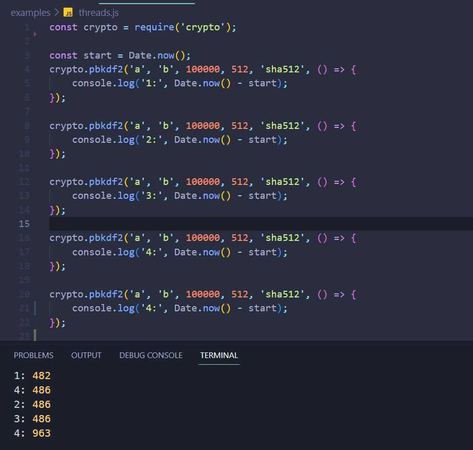
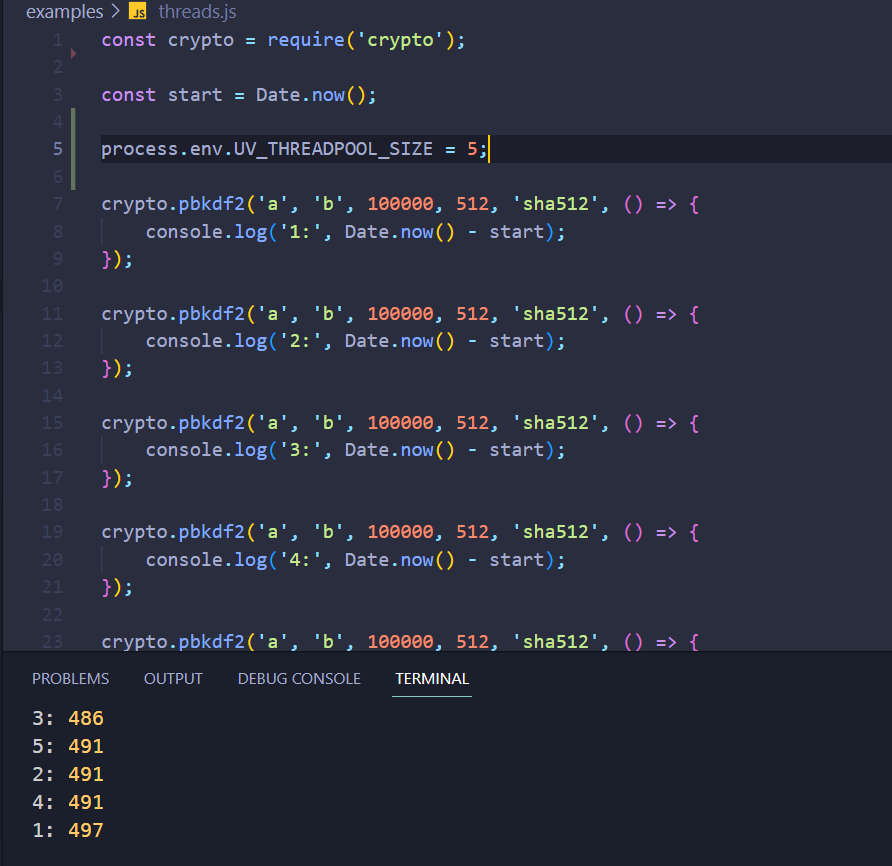

## TL;DR
- Node.js는 자바스크립트 코드가 동작하는 실행 환경(Runtime)으로, Event-Loop와 Thread-Pool을 통해 비동기적으로 동작한다.
- 이벤트 루프는 특정 시점에 어느 코드를 실행할 지 결정하고, 스레드 풀은 오랜 시간이 걸리는 작업, 또는 타이머와 관련된 작업을 위임 받아 처리한다.
- 스레드풀 사이즈는 환경변수를 통해ㅔ 개발자가 직접 조작할 수 있으며, 프로세스의 갯수를 고려하여 설정해야 한다.

## Node.js
### 1. JavaScript Runtime, V8, cross-platform
JS는 정적이었던 웹페이지에 사용자와의 상호작용을 가능하도록 하기 위해 개발된 언어다.   
자연스럽게 JS는 브라우저에서만 실행되었으며 그 목적에 맞게 제한된 기능만을 가지고 있었다.   
웹 브라우저는 JavaScript가 실행되는 환경, 즉 유일한 JavaScript Runtime이었다고 할 수 있다.  
그런 JS를 브라우저 외부(cross-platform ➡ Windows, Linux, MacOS)에서도 사용할 수 있도록   
1. Google에서 개발한 JavaScript Runtime인 V8 엔진이라는 오픈 소스와,   
2. libuv라는 오픈 소스 라이브러리를 기반으로 동작하는 Runtime이 Node.js라고 할 수 있다.   

Node.js는 개발자가 작성한 JS 코드를 해석하고 실행하는 역할을 하며,   
C언어로 작성된 libuv 모듈을 사용하기 위해 V8 엔진의 도움을 받아 브라우저의 JS에서는 불가능한 동작을 수행한다.

### 2. 싱글 스레드
Node.js 기반의 어플리케이션은 실행될 때 하나의 스레드를 생성한다.
해당 스레드 안에는 특정 시점에 어떤 코드를 실행할 지를 결정하는 '이벤트 루프'가 존재한다.
이벤트 루프는 처리 시간이 긴 작업(crypto 모듈 등)을 스레드 풀에 위임하여 처리한다.
스레드 풀은 기본적으로 4개의 스레드로 구성되어 있으며,
스레드 풀이 위임받아 처리하는 작업은 완료되기 전까지 pending 상태로 남아 있다.
이벤트 루프의 콜 스택이 모두 비워지면 스레드 풀에 위임하여 처리한 작업을 마저 진행한다.

## 이벤트 루프
Node.js의 비동기적인 동작의 핵심이라고 할 수 있는 이벤트 루프는 특정한 규칙에 따라
특정 시점에 어떤 코드를 실행할 지 결정한다.
대략적인 순서는 다음과 같다.
1. JS 코드가 실행되면서 이벤트 루프가 생성된다.
2. 코드를 순차적으로 실행해 나가며 비동기적인 타이머, OS, 처리에 오랜 시간이 걸리는 작업들을 스레드 풀에 위임한다.
3. 동기적으로 작동하는 코드는 'Tick' 단위로 실행되는데, 각 코드 블록의 실행을 마칠 경우 바로 다음 작업을 재개하지 않고 처리가 완료된 'pending task'가 있는지 확인한다.
4. 만약 pending된 Timers, OS, Operation(crypto 모듈 등)이 있을 경우 동기적 코드의 실행을 일시 중단한 이후 스레드 풀에게 작업을 전달받아 처리를 진행한다.
5. 동기적으로 작동하는 모든 코드를 실행한 이후, setImmediate 함수의 콜백 함수를 실행한다.
6. 모든 작업이 완료될 경우, 'close' 이벤트와 관련된 작업을 진행하고, 코드의 실행을 종료한다.
이벤트 루프에 의해 작업을 위임 받는 스레드풀은 기본적으로 4개로 설정되며,
환경 변수를 통해 이를 제어할 수 있다.
비동기적으로 동작하는 crypto 모듈의 pbkdf2 함수를 통해 이를 확인할 수 있다.
다음과 같은 함수는 4번의 작업을 마친 이후에야 5번째 작업을 진행하지만,

스레드 풀을 늘려 실행할 경우 5개의 작업이 병렬적으로 처리된다.
(process.env.UV_THREADPOOL_SIZE = 5;)

이때 스레드 풀의 개수가 논리적인 CPU 범위를 초과할 경우, CPU 스케줄링에 의해 오히려 성능 저하시키는 원인이 될 수 있기에 스레드 풀을 설정할 때는 해당 부분을 고려해야 한다.