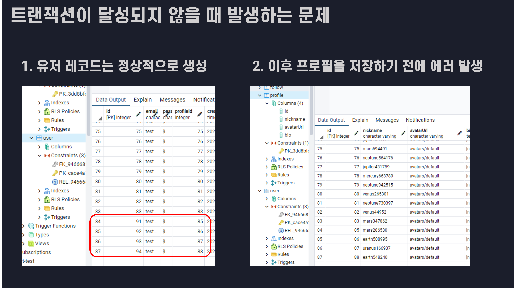
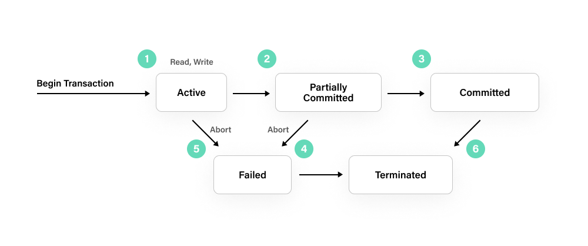

## TL;DL
- 트랜잭션은 데이터베이스에서 발생하는 일련의 작업 묶음의 원자성을 보장하는 것을 의미한다.
- 여러 작업 묶음을 하나의 세션으로 묶고, 하나라도 실패하면 이전의 상태로 복구하는 방식으로 처리된다.
- 트랜잭션이 적용되지 않을 경우 데이터의 무결성이 무너지거나, 의도하지 않은 결과를 발생시킬 수 있다.

## 1. 트랜잭션(Transaction)?
트랜잭션의 사전적인 의미는 "쪼갤 수 없는 업무 처리의 최소 단위"이다.

데이터베이스의 트랜잭션은 여러 작업을 하나의 단위로 묶어,

해당 묶음 전체가 성공하거나 실패하거나 둘 중 하나의 결과만을 갖도록 하는 것을 의미한다.

일반적으로 DBMS에서 하나의 쿼리로 작업을 진행하는 경우에도

각각의 작업들은 트랜잭션으로 처리되기 때문에 여러 작업 묶음만이 트랜잭션의 대상이 되는 것은 아니다.

예전에는 트랜잭션이 SQL의 강점이라고 여겨졌다고 하는데,

몽고DB에서도 4.0 버전부터 트랜잭션을 지원하기 때문에

SQL만의 강점이라고 보기는 어렵다고 할 수 있다.

## 2. 트랜잭션의 필요성
트랜잭션의 필요성을 느낀 건 몽고DB에서 auto increment id를 구현하면서 였는데,

몽고DB에서는 별도의 sequences 컬렉션을 두고,

다른 컬렉션에 다큐먼트를 추가하기 전에 value를 1씩 증가시킨 후 해당 value를 id로 하여

auto increment id를 구현할 수 있다.

하지만 테스트를 진행하면서 sequences 컬렉션의 value는 증가하고,

예상하지 못한 에러로 인해 다큐먼트 삽입에 실패하면서

sequences의 value와 id가 불일치하는 현상이 발생했다.

사이사이에 생략된 id가 있다는 것이 큰 문제를 일으키지는 않겠지만

결제와 정산, 출금과 송금 등의 비즈니스 로직 상에서는 분명 큰 문제가 될 수 있을 것이다.

SQL의 auto increment도 트랜잭션을 지원하지 않기 때문에

철저하게 관리하기를 원한다면 별도의 트랜잭션 로직을 구현해야 한다.

## 3. SQL의 트랜잭션
DBMS마다 조금씩의 차이는 있겠지만,

1) SQL에서는 트랜잭션을 시작하고

2) 일련의 작업을 수행하는 과정에서

3) 하나의 작업이라도 실패하면 롤백,

4) 모두 성공하면 작업 내용을 커밋하고

5) 트랜잭션을 종료

하는 과정을 통해 트랜잭션을 처리한다.

트랜잭션이 실패하는 경우 데이터를 변경하기 전의 데이터를 보관하고 있는

undo log의 데이터를 다시 덮어씀으로써 이전 상태로 되돌아갈 수 있다고 한다.

## 정리
트랜잭션은 DBMS를 통해 데이터를 다룰 때,

일련의 작업의 원자성(모두 성공 또는 실패)을 보장하기 위한 기술이다.

정규화를 통해 연관된 데이터가 여러 테이블로 나누어져있는 SQL에서 특히 필수적이지만,

몽고DB와 같은 NoSQL에서도 트랜잭션을 지원한다.

이렇게 보면 간단해 보이지만,,,

격리 수준(isolation level),

분산 환경에서의 트랜잭션을 위한 사가 패턴, 투페이즈커밋,

분산 락, 트랜잭션 적용을 위한 AOP 등,,,

공부할 게 산더미처럼 쌓여 있다.